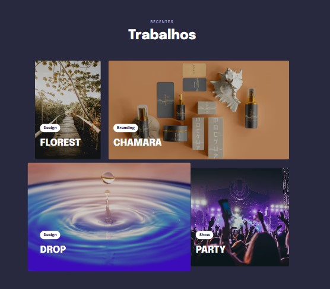

<h1 align="center"> Trabalhos Recentes </h1>

Projeto Web para servir de modelo de portifólio

  <a href="#-tecnologias">Tecnologias</a>&nbsp;&nbsp;&nbsp;|&nbsp;&nbsp;&nbsp;
  <a href="#-projeto">Projeto</a>&nbsp;&nbsp;&nbsp;|&nbsp;&nbsp;&nbsp;

 

  

## 🚀 Tecnologias

Esse projeto foi desenvolvido com as seguintes tecnologias:

- HTML e CSS
- Git e GitHub

## 💻 Projeto

Esse projeto é um site modelo, para portifólio. Ele é responsivo, funciona tanto desktop como mobile

Feito com ♥ by nicholasvp :wave: 
